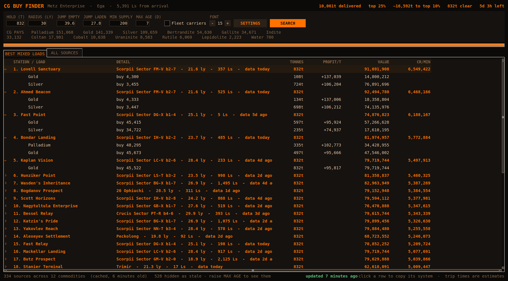
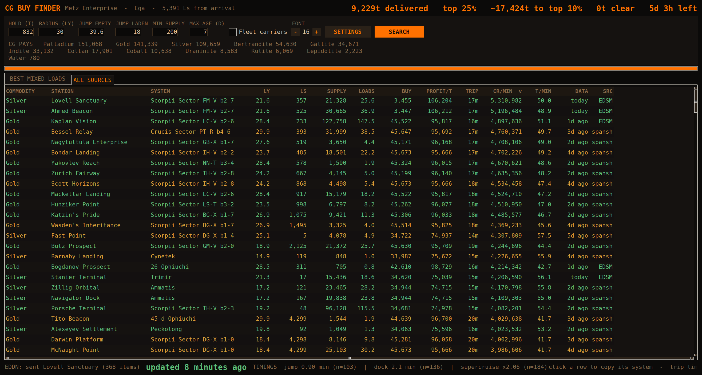
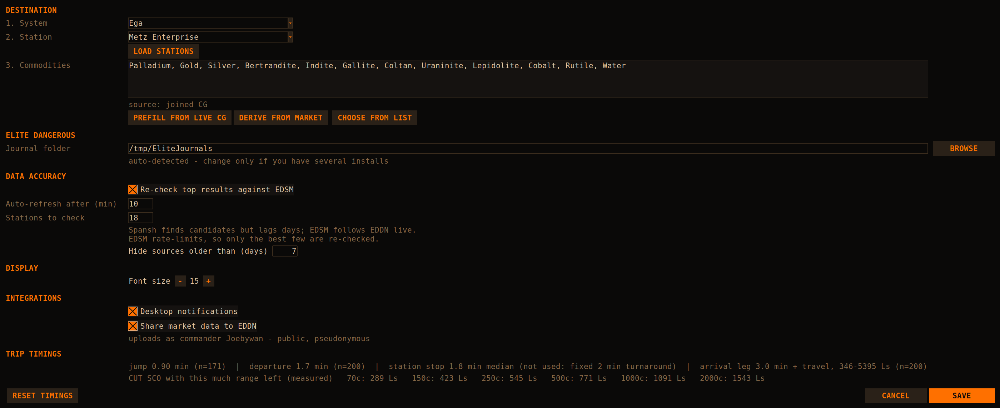

# cgbuy

[](https://github.com/joebywan/ed-cg-buyfinder/actions/workflows/build.yml)
[](#antivirus-false-positives)

Finds the best places to **buy** for an Elite Dangerous community goal, ranked
by credits per minute of round trip — not by profit per tonne, because a rich
station 40 minutes away loses to a decent one 15 minutes away.



It reads your journal to know which goal you joined, what ship you are flying
and how long your jumps actually take, then discovers candidate markets through
Spansh and re-checks the best of them against EDSM, which is days fresher.

## Install

**Download a binary** — no Python needed:

| | |
|---|---|
| [Latest release](https://github.com/joebywan/ed-cg-buyfinder/releases/latest) | stable, version-tagged |
| [Snapshot](https://github.com/joebywan/ed-cg-buyfinder/releases/tag/snapshot) | rebuilt on every push to `main` |

Take `cgbuy-linux` or `cgbuy-windows.exe`. On Linux, `chmod +x cgbuy-linux`
first. Neither is code-signed, so Windows SmartScreen will warn on first run
("More info" → "Run anyway").

**Or run from source** — Python 3 with tkinter, nothing else:

```
git clone https://github.com/joebywan/ed-cg-buyfinder
cd ed-cg-buyfinder
python cgbuy
```

Building your own binary: `./build.sh` on Linux, `build.bat` on Windows.
PyInstaller cannot cross-compile, so each has to be built on the OS it targets
— which is what the CI matrix does.

## What you are looking at

The **best mixed loads** view groups by station and shows what to buy there.
A station's most profitable commodity is often capped below your hold, so it
tops up with that station's next best — no extra travel, more credits.

Expand a row for the per-commodity breakdown, or switch to **all sources** for
the flat sortable table:



`SRC` says whether a row was verified against EDSM or is still Spansh's
figure, and `DATA` is colour-coded by age — stale supply is the single
biggest cause of a wasted trip.

Click any row to copy its system to the clipboard.


## Destination



The tool works out where you are selling rather than asking:

1. **The community goal you joined.** Your journal records it — station,
   system and expiry — and Frontier's feed supplies that goal's commodity
   list.
2. **A live trade goal you have not joined.** If one is running it is used
   anyway — routes are never withheld — with a dismissible notice explaining
   that you need to sign up at the goal board first, since deliveries made
   before you register do not count. Dock at that station while still
   unregistered and it reminds you again, which is the one moment the
   reminder is worth anything. Everything clears the moment the journal shows
   you joining.
3. **Whatever you set by hand**, which always wins and is never overwritten.

**Settings → DESTINATION** takes a system (with name completion), then
`LOAD STATIONS` lists that system's markets, nearest arrival star first.
`CHOOSE FROM LIST` opens a filterable checklist of everything the destination
trades — type to narrow it, click to tick, `ADD SHOWN` to take every match at
once — so the commodity list never has to be typed out. `PREFILL FROM LIVE CG`
lists the running trade goals; `DERIVE FROM MARKET`
reads the market of the station you are docked at and picks out whatever it
pays a premium for — at a goal station that recovers the list exactly, and at
an ordinary station it finds what that place is short of.

No community goal anywhere? Set a station and it works as a plain hauling
tool.

## The idea

A run carries at most one hold of cargo. The time cost of the trip is the same
whether the hold is full of Water or full of Palladium, so **the tonnage per run
is capped by the hold, and the only thing that varies is profit per tonne.**
Haul the most valuable tonne you can fill the hold with.

That runs into supply. The station with the best profit/t often only has 200t of
it, well under an 800t hold. So the tool also builds **mixed loads**: for each
station it sorts that station's stock by profit per tonne and fills the hold
greedily — take all of the best commodity, top up with the next best, and so on.
The extra tonnage costs no extra travel, which is why a mixed load usually beats
the same station's single-commodity number.

Scoring: `cr_per_min = (tonnes loaded × profit per tonne) / estimated round-trip
minutes`. The round trip is jumps out (empty range) + jumps back (laden range) +
supercruise/approach at both ends + two dock cycles.

Filters applied when collecting sources: large landing pad required, supply and
buy price must be positive, profit must be positive, and the station must be
inside the radius. Fleet carriers are excluded unless you tick the box.

## Install and run

**The app** (`./cgbuy`, a tkinter desktop app, no `.py` extension):

```
./cgbuy                  # searches immediately
./cgbuy --no-autosearch  # open without hitting the APIs
```

Needs Python 3 with tkinter (`python3-tk` on Debian/Ubuntu/Mint) and a desktop
session. Stdlib only — no pip installs, no network at install time. It will exit
with a clear message if there is no display.

**A standalone binary:**

```
./build.sh
```

Creates a `.venv`, installs PyInstaller from PyPI (the only time the build needs
network), and produces `./cgbuy-linux` — a single file with Python bundled. It
still needs the system's tkinter and glibc, so the binary is Linux-specific and
not portable across distro generations.

## The two views

**BEST MIXED LOADS** — one expandable row per station, ranked by cr/min. The
parent row is the station, system, distance, arrival Ls, data age, and the total
tonnes the station can actually fill (with `Nt short` if it cannot fill the
hold). Expanding shows each commodity in the mix with its buy price, tonnes, and
profit per tonne. `VALUE` is tonnes × profit/t; `CR/MIN` is the whole plan's
value over the trip estimate. Top 40 stations, first five expanded.

**ALL SOURCES** — one row per commodity-at-station, click any header to sort.

| Column | Meaning |
| --- | --- |
| `LY` | distance from Ega |
| `LS` | arrival distance of the source station from its star |
| `SUPPLY` | tonnes on offer |
| `LOADS` | how many full holds that supply covers |
| `BUY` | price per tonne at the source |
| `PROFIT/T` | CG sell price minus buy price |
| `TRIP` | estimated round-trip minutes |
| `CR/MIN` | credits per minute for a single-commodity run |
| `T/MIN` | tonnes per minute — use this if you care about CG rank rather than credits |
| `DATA` | how long ago a commander last reported this market; green ≤21 days, amber ≤120, red beyond |

The header line shows what the CG currently pays for each commodity (the CG
multiplier is already baked into the EDSM price — the tool does not apply it).

## Interface

Inputs across the top: hold size, radius (30 ly), jump range empty and laden,
minimum supply (200), and a fleet-carrier toggle. Enter or SEARCH runs it.

Hold and the two jump ranges are marked `*` and locked while your journal can
see a ship — they are the ship's, not yours to guess at. Hover one to see
where its number came from. See [Ship detection](#ship-detection).

**Font scaling.** The default size is picked from your screen width (9pt under
2560px, 14 under 3840, 17 above). The `- 9 +` control, or Ctrl+`+` / Ctrl+`-`,
rescales everything — fonts, row heights, column widths, and the window itself —
and the choice is saved.

**Settings** (SETTINGS button): journal folder (auto-detected, override only if
you have several installs), how many top results to re-check against EDSM,
toggles for the deck button and EDDN, and a readout of current trip timings
with a reset.

**Config** lives at `~/.config/cgbuy.json` (`$XDG_CONFIG_HOME` respected) and holds font
size, journal path, search parameters, the integration toggles, EDSM
verification settings and accumulated calibration samples.

## Journal calibration

The shipped trip model is guesswork: 0.85 min per jump, 3 min docked, and a
supercruise curve (`0.25 × Ls^0.3`) fitted by eye. The app tails your Elite
journals and replaces those guesses with what actually happens to you:

- **jump cycle** — FSDJump to FSDJump, counted only when 15–300s apart, so a stop
  mid-route is not charged as jump time
- **arrival leg** — FSDJump to Docked, i.e. supercruise plus approach plus
  docking, paired with the station's arrival Ls to scale the supercruise curve
- **dock time** — Docked to Undocked, counted separately so nothing is
  double-counted
- **supercruise** — SupercruiseEntry to exit, when the game logs it; the arrival
  leg is the fallback because it is journalled far more reliably

Each measurement needs **at least 3 samples** before it is used at all, and the
value is a median, so one 500,000 Ls outlier cannot swing it. Until then the
estimate stands, and the status bar says `estimate (n=…)`. On first run it
back-fills from your last six journal files. It keeps the most recent 200
samples of each kind in the config.

Docking at Metz Enterprise triggers an automatic re-search — the run just ended,
so the next one gets fresh data.

## EDDN sharing

**Off by default, opt-in in Settings.** When on, every time the game writes
`Market.json` (a `Market` journal event) the tool sends that station's commodity
table to EDDN under the `commodity/3` schema, the same way EDMC does.

What is sent: system name, station name, market ID, timestamp, station type, the
Horizons/Odyssey flags, and the price/stock/demand table the game already wrote.
Limpets and non-marketable goods are stripped. Nothing else — no position, no
ship, no cargo. **Your commander name is the uploader ID**, exactly as every
other uploader does it: public and pseudonymous. Messages are validated locally
against the schema before sending, and each market snapshot is sent at most once.

Everything this tool reads came from someone else doing this, which is the
argument for turning it on.


to **a single button in your existing deck software** (OpenDeck or anything
device, and does not replace your setup.

From an OpenDeck flatpak button:

```
```

Each press reads the ranked target list the app publishes to
`~/.config/cgbuy-state.json`, prints the current target, then
advances the index so the next press moves you on. It prints the station,
system, mix, distance and value on stdout, so deck software that renders command
output shows it on the button face.

```
```

It respects the `deck_enabled` toggle in the config and reports if the app has
not produced targets yet.

## Limitations

- **Trip times are estimates.** Even calibrated, they are medians of your past
  flying, not a prediction of this run. Interdictions, traffic, and a bad
  approach are not modelled.
- **Market data is only as fresh as the last commander to visit.** Supply drains
  fast during a CG, and a station showing 40,000t three weeks ago may be empty.
  Watch the DATA column; it is coloured for exactly this reason.
- **Fleet carriers move and reprice.** Off by default for that reason.
- **`cgbuy-linux` is glibc/Linux-specific** and still depends on the system's
  tkinter. Build it on the machine you will run it on.
- **The CG is hardcoded** — station, system, and the twelve commodities are
  constants at the top of the source.

## Windows and macOS

The code is portable; only the prebuilt binary is not. `cgbuy-linux` is an ELF
executable and PyInstaller cannot cross-compile, so a Windows `.exe` has to be
built on Windows.

**Run from source** (simplest — Python 3 from python.org includes tkinter):

```
python cgbuy
```

The file has no `.py` extension, so Windows will not associate it; invoke it
through `python` as above rather than double-clicking it.

**Build an .exe:** `build.bat`, the Windows counterpart of `build.sh`.

What adapts automatically:

- **Journals** — `%USERPROFILE%\Saved Games\Frontier Developments\Elite Dangerous`,
  including the OneDrive-redirected variant, plus Steam libraries on other
  drive letters. Override it in Settings if detection misses.
- **Config** — `%APPDATA%\cgbuy.json` on Windows, `~/Library/Application Support`
  on macOS, `~/.config` elsewhere. `XDG_CONFIG_HOME` always wins if set.
- **Cache** — `%LOCALAPPDATA%` / `~/Library/Caches` / `~/.cache`.
- **Font** — first installed of DejaVu Sans Mono, Consolas, Menlo, Liberation
  Mono, Courier New.

Nothing in the tool shells out or calls a POSIX-only API, so there is no
platform-specific behaviour beyond those paths.

## Antivirus false positives

A handful of engines flag the Windows binary. As of the 2026-09-12 snapshot,
VirusTotal put it at 11/70, and the detections are generic:
`Gen:Variant.Application.Tedy`, `BehavesLike.Win64.Injector`. Eight of those
eleven are the same BitDefender engine under OEM licence, so they are one
verdict wearing eight badges. Microsoft, Kaspersky, ESET, Sophos, CrowdStrike,
SentinelOne, Symantec and Malwarebytes all read it as clean.

The cause is the packaging, not the code. `--onefile` appends a ~12 MB
compressed archive to a small stub; at runtime the stub unpacks CPython, Tcl/Tk
and the extension modules to a temporary directory and executes from there.
A high-entropy blob glued to an unsigned executable that then self-extracts and
runs is, to a heuristic, indistinguishable from a dropper. Every PyInstaller
one-file build in the world trips the same wires.

If you would rather not take that on trust:

- **Run from source** — `python cgbuy`. No binary, no packaging, and the source
  is all in this repository.
- **Check the hash.** `Get-FileHash cgbuy-windows.exe` on Windows, `sha256sum`
  elsewhere, against the file on the Releases page.
- **Read the sandbox report** rather than the score. The relevant question is
  what it did: contacted hosts, files written, processes spawned.

The binary is not code-signed, and will not be. A certificate is a recurring
annual cost and this is a free tool written for its author's own use; sharing it
is a courtesy. Signing would likely quiet the heuristics, but not at that price.

False positives are reported to the vendors as they come up. Beyond that, the
options above are the answer: run from source, check the hash, read the sandbox
report — or don't run it. All three are reasonable.

Every release scans itself. After a version is published, CI submits both
binaries to VirusTotal and appends the detection counts, hashes and the names
of any flagging engines to the release notes. The numbers are a point-in-time
reading and the links show the current verdict — but it means anyone forwarded
an alarming-looking scan link finds the same figures already on the download
page, with this section next to them, rather than having to guess.

## Notifications

The window normally sits behind the game, so it tells you when something
changes rather than waiting to be looked at:

- **the best target changed** — a different station is now top, usually
  because the previous one drained or fresher data arrived
- **your reward bracket moved** — up, or *down* when other commanders
  overtake you, which is the one you would otherwise never see coming

Delivered through `notify-send` on Linux, a toast on Windows 10+, and
`osascript` on macOS. Whatever the platform, the window title is also marked
and the bell rung, so there is a visible sign even with no notification
daemon; the mark clears when you next focus the window. Turn it off with
**Desktop notifications** in Settings.

The status bar also shows how long ago the shown data was fetched, ticking
live and turning amber once it passes the auto-refresh threshold — so you can
tell at a glance whether docking at the destination actually refreshed it.

## Ship detection

Hold size, jump ranges and landing-pad class are read from the game's
`Loadout` event, not typed in. **While a journal is readable it is the source
of truth**: those boxes show the ship's own figures, are locked, and update
themselves. They unlock only when no journal names a ship — with nothing to
read, your estimate is all there is, and it is remembered between sessions.
(The starter-hauler numbers behind them are deliberately small: too small is
visibly wrong, whereas a plausible big-ship number would just be believed.)

Swapping ships, refitting, or flying a longer laden jump than before all
update the toolbar live, without a restart. A swap is taken from `Loadout`,
`ShipyardSwap`, `ShipyardNew` or `LoadGame`, and the previous ship's figures
are dropped the instant the hull changes rather than lingering — priming reads
several journals back, so a swap is ordinary, and a Panther's 832t hold on a
Cobra would plan confident runs you cannot fly. Between the swap and the new
`Loadout` the status bar says so. Once the new figures land, the results are
re-run automatically: pad class decides which stations are eligible at all, so
what was on screen was about a ship you are no longer flying.

Laden jump range is the one the game never reports. It is derived from the
mass ratio — FSD range is inversely proportional to total mass, so the unladen
maximum scales by `(hull + fuel) / (hull + fuel + cargo)` — and then floored by
the longest jump you have actually made with cargo aboard, which is hard
evidence no formula can argue with.

This matters more than it sounds. An underestimate makes the tool think the
return leg needs an extra jump, inflating every trip time and quietly biasing
the ranking against the nearer stations.
